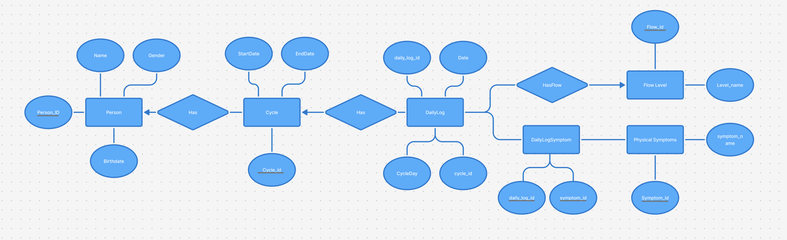

# Cycle Tracker Web App
This project is a cycle tracking web application. The user can select dates in a calendar, create and update daily logs, choose a flow level, select physical symptoms, and search previous logs using regular expression matching.

The project uses:

- ASP.NET Core / C# backend
- React / Vite frontend
- PostgreSQL database
- Raw SQL through Npgsql
- Redux for frontend state management

# Prerequisites

Make sure the following are installed before running the project:

- [.NET SDK 9.0](https://dotnet.microsoft.com/download)
- [Node.js 22+](https://nodejs.org/)
- [PostgreSQL 15+](https://www.postgresql.org/download/)

# Project Structure

```
DIS-Project/
├── DIS.Backend/
│   ├── Controllers/
│   ├── CycleTracker/
│   │   ├── Interfaces/
│   │   └── Models/
│   ├── Data/
│   │   ├── Schema.sql
│   │   └── Seed.sql
│   ├── DTO/
│   └── Interfaces/
├── DIS.Frontend/
│   └── WebApp/
│       ├── css/
│       └── src/
│           ├── actions/
│           ├── Pages/
│           └── reducers/
├── docs/
│   └── er-diagram.png
└── README.md
```

# E/R Diagram

The database model is shown here:



The main database tables are:
- `persons`
- `cycles`
- `daily_logs`
- `flow_levels`
- `physical_symptom`
- `daily_log_symptoms`

# Database Setup

The project expects a PostgreSQL database called `cycle_tracker` and a user `cycle_user`.

To create the database and user, run the following in psql:

```sql
CREATE ROLE cycle_user WITH LOGIN PASSWORD 'cycle_password';
CREATE DATABASE cycle_tracker OWNER cycle_user;
```

Then initialize the database by running these files in order:

```
DIS.Backend/Data/Schema.sql
DIS.Backend/Data/Seed.sql
```

`Schema.sql` creates the tables, and `Seed.sql` inserts test data.

## Connection string

Create the file `DIS.Backend/appsettings.Development.json` with the following content:

```json
{
  "ConnectionStrings": {
    "DefaultConnection": "Host=localhost;Port=5432;Database=cycle_tracker;Username=cycle_user;Password=cycle_password"
  }
}
```

# Compile and Run

## Backend

Open a terminal in the project root and run:

```bash
cd DIS.Backend
dotnet restore
dotnet build
dotnet run --launch-profile http
```

The backend runs on: `http://localhost:5221`

## Frontend

Open a second terminal in the project root and run:

```bash
cd DIS.Frontend
npm install
npm run dev
```

The frontend runs on: `http://localhost:5173`

Open this URL in a browser.

# How to Use the Web App

The app has three main panels:

- **Symptom search** on the left
- **Calendar** in the middle
- **Daily log editor** on the right

Click a date in the calendar to select it. If a daily log already exists for that date, the saved data is loaded. If no log exists, you can create one.

For each daily log, you can:

- Choose a flow level
- Select one or more physical symptoms
- Save a new daily log
- Update an existing daily log

The symptom search panel supports regular expressions. It searches all previous daily logs and highlights matching dates in the calendar. Examples: `mood`, `^m`, `cramp|fatigue`.

# SQL and Regex

The app interacts with the PostgreSQL database using raw SQL through Npgsql. The backend uses SQL statements such as SELECT, INSERT, UPDATE and DELETE in `CycleTrackerRepository.cs`.

The app also performs regular expression matching in the symptom search feature. The user can enter a regex pattern, and the backend searches for daily logs where the symptom name matches the pattern.

## AI Declaration

We used AI tools in this project, mainly ChatGPT. AI was used for idea generation, help with setting up standard parts of the program in the beginning, explaining error messages, and support with debugging when problems occurred.

Most of the code was written by us, and everything has been reviewed, adapted, and tested by us.